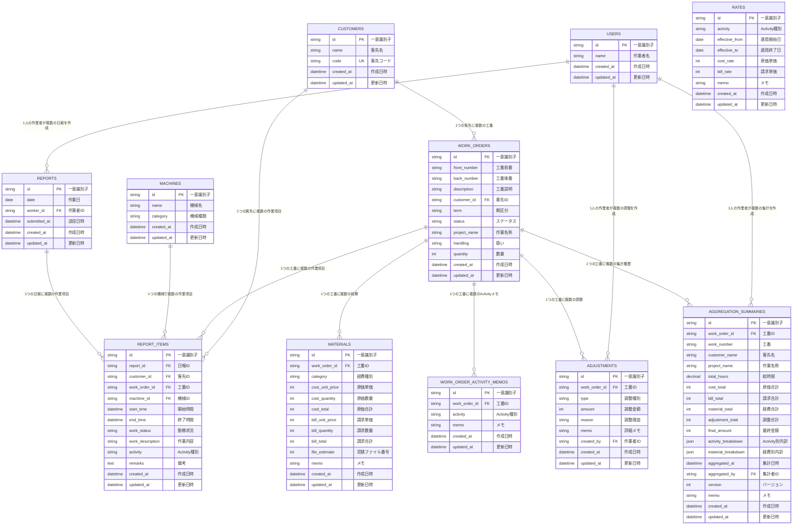

# データベーススキーマ構成図

## 概要
日報アプリのデータベース構成を視覚的に示したER図です。日報管理機能と集計機能の両方を含みます。

## テーブル構成図



## テーブル詳細

### 📋 **日報管理テーブル**

#### 👤 **USERS（ユーザーテーブル）**
- **目的**: 作業者情報を管理
- **主要フィールド**: 作業者名
- **関連**: 日報、調整履歴、集計サマリーの作成者

#### 🏢 **CUSTOMERS（客先テーブル）**
- **目的**: 客先情報を管理
- **主要フィールド**: 客先名、客先コード
- **特記**: 背景色の条件分岐に使用（例：クオール市原）

#### 🔢 **WORK_ORDERS（工番テーブル）**
- **目的**: 工番情報を管理
- **主要フィールド**: 
  - 前番・後番（工番を構成）
  - 期区分（59期、59期-JFE等）
  - ステータス（aggregating/aggregated）
  - 作業名称、扱い、数量
- **関連**: 客先に紐づく
- **集計機能**: 集計のベースとなるテーブル

#### 🏭 **MACHINES（機械テーブル）**
- **目的**: 機械情報を管理
- **主要フィールド**: 機械名、機械種類
- **特記**: 背景色の条件分岐に使用（例：12尺、正面盤、1052）

#### 🗂️ **REPORTS（日報テーブル）**
- **目的**: 日報の基本情報を管理
- **主要フィールド**: 作業日、作業者、送信日時
- **関連**: 1つの日報に複数の作業項目が紐づく

#### 📝 **REPORT_ITEMS（日報項目テーブル）**
- **目的**: 各作業項目の詳細情報を管理
- **主要フィールド**: 
  - 開始時間、終了時間
  - 作業内容、勤務状況
  - Activity種別（自動判定）
- **重要**: `work_description`フィールドで各作業項目独立の作業内容を管理
- **Activity**: NORMAL/TRAINEE1/INSPECTION/M_1052/M_SHOMEN/M_12SHAKU

---

### 💰 **集計管理テーブル**

#### 💵 **RATES（単価マスタテーブル）**
- **目的**: Activity別の単価を管理
- **主要フィールド**: 
  - Activity種別
  - 適用開始日・終了日（履歴管理）
  - 原価単価・請求単価
  - メモ
- **特徴**: 
  - 時系列での単価変更に対応
  - effectiveTo が NULL の場合、現在有効な単価

#### 📊 **ADJUSTMENTS（調整履歴テーブル）**
- **目的**: 工番ごとの金額調整を記録
- **主要フィールド**: 
  - 調整種別（rate_adjustment/memo_update等）
  - 調整金額（プラス・マイナス可能）
  - 調整理由、詳細メモ
  - 作成者
- **用途**: 
  - 単価変更による調整
  - 手動調整の履歴管理
  - 監査証跡

#### 🧾 **MATERIALS（材料費・経費テーブル）**
- **目的**: 工番ごとの経費を管理
- **主要フィールド**: 
  - 経費種別（materials/outsourcing/shipping/travel/other）
  - 原価（単価・数量・合計）
  - 請求（単価・数量・合計）
  - 見積ファイル番号、メモ
- **特徴**: 
  - 原価と請求を別々に管理
  - 一部カテゴリは自動で1.2倍の請求額を算出

#### 📝 **WORK_ORDER_ACTIVITY_MEMOS（Activity別メモテーブル）**
- **目的**: 工番×Activity単位でのメモを管理
- **主要フィールド**: 
  - 工番ID
  - Activity種別
  - メモ
- **特徴**: 
  - 工番IDとActivityの組み合わせで一意
  - 単価調整時の備考などを保存

#### 📈 **AGGREGATION_SUMMARIES（集計サマリーテーブル）**
- **目的**: 確定した集計結果を保存
- **主要フィールド**: 
  - 工番情報（工番、客先名、作業名称）
  - 集計結果（総時間、原価合計、請求合計、経費合計、調整合計、最終金額）
  - Activity別内訳（JSON）
  - 経費別内訳（JSON）
  - 集計者、集計日時、バージョン
- **用途**: 
  - 集計完了時のスナップショット
  - 過去の集計結果の参照
  - レポート生成の基礎データ

---

## 🔗 **主要なリレーション**

### 日報管理のリレーション
1. **USERS ↔ REPORTS**: 1対多（1人の作業者が複数の日報を作成）
2. **REPORTS ↔ REPORT_ITEMS**: 1対多（1つの日報に複数の作業項目）
3. **CUSTOMERS ↔ WORK_ORDERS**: 1対多（1つの客先に複数の工番）
4. **WORK_ORDERS ↔ REPORT_ITEMS**: 1対多（1つの工番で複数の作業項目）
5. **MACHINES ↔ REPORT_ITEMS**: 1対多（1つの機械で複数の作業項目）

### 集計管理のリレーション
1. **WORK_ORDERS ↔ ADJUSTMENTS**: 1対多（1つの工番に複数の調整履歴）
2. **WORK_ORDERS ↔ MATERIALS**: 1対多（1つの工番に複数の経費）
3. **WORK_ORDERS ↔ WORK_ORDER_ACTIVITY_MEMOS**: 1対多（1つの工番に複数のActivityメモ）
4. **WORK_ORDERS ↔ AGGREGATION_SUMMARIES**: 1対多（1つの工番に複数の集計履歴）
5. **USERS ↔ ADJUSTMENTS**: 1対多（1人の作業者が複数の調整を作成）
6. **USERS ↔ AGGREGATION_SUMMARIES**: 1対多（1人の作業者が複数の集計を作成）

---

## 📊 **データフロー**

### 日報登録フロー
```
1. 作業者が日報を作成 (REPORTS)
   ↓
2. 複数の作業項目を追加 (REPORT_ITEMS)
   ↓
3. 各作業項目に以下を設定:
   - 客先 (CUSTOMERS)
   - 工番 (WORK_ORDERS)
   - 機械 (MACHINES)
   - 作業内容 (work_description)
   ↓
4. Activity自動判定
   - 機械種別と作業者から自動判定
   - REPORT_ITEMS.activityに保存
```

### 集計処理フロー
```
1. 工番を選択してステータスを「集計中」に変更
   ↓
2. 関連する日報項目を取得 (REPORT_ITEMS)
   ↓
3. Activity別に集計
   - 時間計算
   - 単価マスタ参照 (RATES)
   - 原価・請求額計算
   ↓
4. 経費を入力・編集 (MATERIALS)
   ↓
5. 単価調整（必要に応じて）
   - 単価変更 → 調整履歴作成 (ADJUSTMENTS)
   - Activity別メモ保存 (WORK_ORDER_ACTIVITY_MEMOS)
   ↓
6. 集計完了
   - ステータスを「集計済み」に変更
   - 集計サマリー作成 (AGGREGATION_SUMMARIES)
   - Jootoタスク移動（該当する場合）
```

---

## 🌟 **重要な機能と設計ポイント**

### 1. **Activity自動判定機能**
- **目的**: 作業内容から単価区分を自動判定
- **判定基準**: 
  - 機械種別（1052/正面盤/12尺）→ 機械別Activity
  - 作業者名（「研修生」を含む）→ TRAINEE1
  - 作業内容（「検査」を含む）→ INSPECTION
  - デフォルト → NORMAL
- **保存先**: REPORT_ITEMS.activity

### 2. **単価履歴管理**
- **目的**: 単価変更の履歴を保持
- **仕組み**: 
  - effective_from/effective_to で期間管理
  - 単価変更時、既存レコードに終了日を設定し、新レコード作成
  - 調整履歴（ADJUSTMENTS）に変更内容を記録

### 3. **調整履歴の追跡**
- **目的**: すべての金額調整を追跡可能に
- **記録内容**: 
  - 単価調整（rate_adjustment）
  - メモ更新（memo_update）
  - 調整金額、理由、作成者

### 4. **集計サマリーのスナップショット**
- **目的**: 集計完了時の状態を保存
- **保存内容**: 
  - 全体の集計結果
  - Activity別内訳（JSON）
  - 経費別内訳（JSON）
- **バージョン管理**: 再集計時にバージョンを増加

### 5. **経費管理の柔軟性**
- **原価と請求の分離管理**
- **自動マークアップ機能**: 材料・外注・配送は原価×1.2を請求額に設定
- **見積ファイル連携**: file_estimateフィールドで見積と紐付け

---

## 🎨 **表示ロジック連携**

このデータベース設計により、以下の機能が実現されています：

### 日報管理機能
- **背景色の条件付きフォーマット**
  - 客先名（CUSTOMERS.name）
  - 機械種類（MACHINES.category）
- **勤務状況による時間計算**
  - REPORT_ITEMS.work_status
- **高度なフィルタリング**
  - 全テーブルの情報を組み合わせた検索

### 集計管理機能
- **Activity別集計表示**
  - RATES テーブルから単価取得
  - REPORT_ITEMS から時間集計
- **経費一覧表示**
  - MATERIALS テーブルから取得
  - 原価・請求を並列表示
- **調整履歴表示**
  - ADJUSTMENTS テーブルから取得
  - 時系列で表示
- **集計サマリー表示**
  - AGGREGATION_SUMMARIES から取得
  - 確定した集計結果を参照

---

## 🔄 **スキーマ更新履歴**

- **2024-08-25**: 初版作成（日報管理機能）
- **2025-01-27**: 単価・経費へのmemoフィールド追加
- **2025-02-15**: 経費管理の拡張（見積ファイル連携等）
- **2025-02-21**: work_order_activity_memosテーブル追加、aggregation_summariesテーブル追加

---

**作成日**: 2024-08-25  
**最終更新日**: 2025-02-21  
**バージョン**: 2.0
