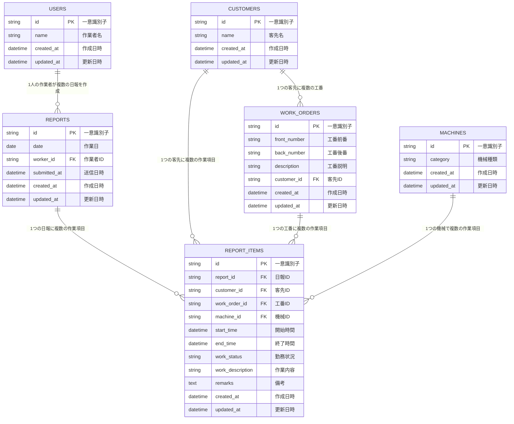

# データベーススキーマ構成図

## 概要
日報アプリのデータベース構成を視覚的に示したER図です。

## テーブル構成図



## テーブル詳細

### 🗂️ **REPORTS（日報テーブル）**
- **目的**: 日報の基本情報を管理
- **主要フィールド**: 作業日、作業者、送信日時
- **関連**: 1つの日報に複数の作業項目が紐づく

### 📝 **REPORT_ITEMS（日報項目テーブル）**
- **目的**: 各作業項目の詳細情報を管理
- **主要フィールド**: 開始時間、終了時間、作業内容、勤務状況
- **重要**: `work_description`フィールドで各作業項目独立の作業内容を管理

### 👤 **USERS（ユーザーテーブル）**
- **目的**: 作業者情報を管理
- **主要フィールド**: 作業者名

### 🏢 **CUSTOMERS（客先テーブル）**
- **目的**: 客先情報を管理
- **主要フィールド**: 客先名
- **特記**: 背景色の条件分岐に使用（例：クオール市原）

### 🔢 **WORK_ORDERS（工番テーブル）**
- **目的**: 工番情報を管理
- **主要フィールド**: 前番、後番、工番説明
- **関連**: 客先に紐づく

### 🏭 **MACHINES（機械テーブル）**
- **目的**: 機械種類を管理
- **主要フィールド**: 機械種類
- **特記**: 背景色の条件分岐に使用（例：12尺、正面盤、1052）

## 🔗 **主要なリレーション**

1. **REPORTS ↔ REPORT_ITEMS**
   - **関係**: 1対多
   - **説明**: 1つの日報に複数の作業項目

2. **USERS ↔ REPORTS**
   - **関係**: 1対多
   - **説明**: 1人の作業者が複数の日報を作成

3. **CUSTOMERS ↔ REPORT_ITEMS**
   - **関係**: 1対多
   - **説明**: 1つの客先で複数の作業

4. **WORK_ORDERS ↔ REPORT_ITEMS**
   - **関係**: 1対多
   - **説明**: 1つの工番で複数の作業項目

5. **MACHINES ↔ REPORT_ITEMS**
   - **関係**: 1対多
   - **説明**: 1つの機械で複数の作業項目

## 🌟 **重要な改善ポイント**

### **workDescriptionフィールドの追加**
- **改善前**: `WORK_ORDERS.description`に依存（同じ工番 = 同じ作業内容）
- **改善後**: 各`REPORT_ITEMS`が独立した`work_description`を持つ
- **効果**: 同じ工番でも異なる作業内容を正確に管理可能

## 📊 **データフロー**

```
1. 作業者が日報を作成 (REPORTS)
   ↓
2. 複数の作業項目を追加 (REPORT_ITEMS)
   ↓
3. 各作業項目に以下を設定:
   - 客先 (CUSTOMERS)
   - 工番 (WORK_ORDERS)
   - 機械 (MACHINES)
   - 作業内容 (work_description)
   ↓
4. 背景色やフィルタリングで効率的に管理
```

## 🎨 **表示ロジック連携**

このデータベース設計により、以下の表示機能が実現されています：

- **背景色の条件付きフォーマット**
  - 客先名（CUSTOMERS.name）
  - 機械種類（MACHINES.category）

- **勤務状況による時間計算**
  - REPORT_ITEMS.work_status

- **高度なフィルタリング**
  - 全テーブルの情報を組み合わせた検索

---

**作成日**: 2024-08-25  
**更新日**: 2024-08-25  
**バージョン**: 1.0
