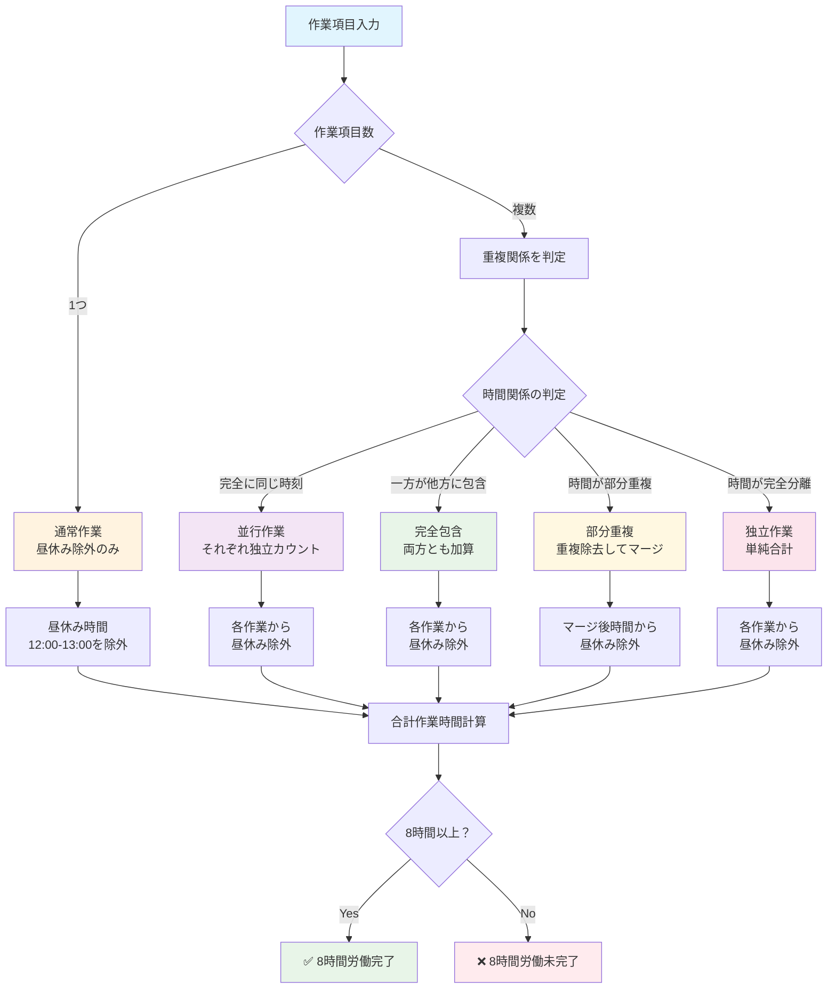

# 作業時間計算ロジック仕様書

## 概要

本システムでは、複数の作業項目がある場合の合計作業時間を適切に計算するため、並行作業・包含関係・部分重複を考慮した計算ロジックを実装しています。

## 基本原則

### 1. 昼休み時間の自動除外
- **対象時間**: 12:00 - 13:00（1時間）
- **適用条件**: 作業時間が昼休み時間をまたぐ場合
- **例外**: 勤務状況が「昼残」の場合は除外しない

### 2. 作業パターンの分類

作業時間計算では、以下の5つのパターンがあります：

#### 2.1 通常作業
単一の作業項目のみの場合

**処理方法**: 昼休み除外のみ

**具体例**:
```
作業1: 08:00-17:00
→ 合計: 8時間（昼休み1時間除外）
```

**適用理由**: 最も基本的な作業パターン

#### 2.2 並行作業（同じ時刻の複数作業）
同じ時間帯に複数の機械や業務を並行して行う場合

**処理方法**: それぞれ独立してカウント

**具体例**:
```
作業1: 08:00-10:00（機械A）
作業2: 08:00-10:00（機械B）
→ 合計: 4時間（2時間 + 2時間）
```

**適用理由**: 経理部の集計要件により、異なる機械での作業は独立して計上する必要がある

#### 2.3 完全包含
一つの作業時間が他の作業時間に完全に含まれる場合

**処理方法**: それぞれ独立してカウント

**具体例**:
```
作業1: 08:00-16:45（メイン作業）= 7時間45分
作業2: 08:00-08:15（準備作業）= 15分
→ 合計: 8時間（7時間45分 + 15分）
```

**適用理由**: 異なる性質の作業として独立して管理する必要がある

#### 2.4 部分重複
作業時間が部分的に重複している場合

**処理方法**: 重複部分を除去してマージ

**具体例**:
```
作業1: 08:00-10:00（2時間）
作業2: 09:00-11:00（2時間）
→ 実際の作業時間: 08:00-11:00 = 3時間
```

**適用理由**: 同一人物が同時に複数の作業を行うことは不可能なため

#### 2.5 独立作業
完全に時間が分かれている作業の場合

**処理方法**: 単純に合計

**具体例**:
```
作業1: 09:00-12:00（3時間）
作業2: 13:00-16:00（3時間）
→ 合計: 6時間（3時間 + 3時間）
```

**適用理由**: 時間重複がないため単純な加算が可能

## ワークフロー図

### 作業時間計算の全体フロー



### パターン別タイムライン例

```mermaid
gantt
    title 作業時間計算パターン別例
    dateFormat HH:mm
    axisFormat %H:%M
    
    section 通常作業
    単一作業（8時間）    :done, normal, 08:00, 17:00
    昼休み             :crit, lunch1, 12:00, 13:00
    
    section 並行作業
    機械A作業          :done, parallel1, 08:00, 17:00
    機械B作業          :done, parallel2, 08:00, 17:00
    昼休み             :crit, lunch2, 12:00, 13:00
    
    section 完全包含
    メイン作業         :done, contain1, 08:00, 16:45
    準備作業           :active, contain2, 08:00, 08:15
    昼休み             :crit, lunch3, 12:00, 13:00
    
    section 部分重複
    作業A              :done, overlap1, 08:00, 10:00
    作業B              :done, overlap2, 09:00, 11:00
    重複部分           :crit, overlap3, 09:00, 10:00
    
    section 独立作業
    午前作業           :done, independent1, 09:00, 12:00
    午後作業           :done, independent2, 13:00, 16:00
    昼休み             :crit, lunch4, 12:00, 13:00
```



## 計算アルゴリズム

### Step 1: 個別作業時間の計算
各作業項目について以下を計算：
1. 基本作業時間（終了時間 - 開始時間）
2. 昼休み時間の除外処理
3. 個別作業時間の確定

### Step 2: 関係性の判定
作業項目間の関係を以下の優先順位で判定：
1. **並行作業**: 開始時間・終了時間が完全に一致
2. **完全包含**: 一方が他方に完全に含まれる
3. **部分重複**: 時間帯が部分的に重複

### Step 3: 合計時間の計算
- 並行作業・完全包含: 各作業時間を加算
- 部分重複: マージした時間範囲で計算

## 実装関数

### `calculateNonOverlappingWorkTime()`
メイン関数として、作業項目配列を受け取り合計作業時間を返す

**引数**:
```typescript
workItems: Array<{
  startTime: string;    // "HH:MM" 形式
  endTime: string;      // "HH:MM" 形式
  workStatus?: string;  // 勤務状況（昼残等）
}>
```

**戻り値**: `number` - 合計作業時間（時間単位）

## テストケース

### ケース1: 通常作業
```javascript
// 入力
[
  { startTime: "08:00", endTime: "17:00" } // 8時間（昼休み除く）
]
// 期待値: 8時間
```

### ケース2: 並行作業
```javascript
// 入力
[
  { startTime: "08:00", endTime: "17:00" }, // 8時間（昼休み除く）
  { startTime: "08:00", endTime: "17:00" }  // 8時間（昼休み除く）
]
// 期待値: 16時間
```

### ケース3: 完全包含
```javascript
// 入力
[
  { startTime: "08:00", endTime: "16:45" }, // 7時間45分（昼休み除く）
  { startTime: "08:00", endTime: "08:15" }  // 15分
]
// 期待値: 8時間
```

### ケース4: 部分重複
```javascript
// 入力
[
  { startTime: "08:00", endTime: "10:00" }, // 2時間
  { startTime: "09:00", endTime: "11:00" }  // 2時間
]
// 期待値: 3時間（08:00-11:00）
```

### ケース5: 独立作業
```javascript
// 入力
[
  { startTime: "09:00", endTime: "12:00" }, // 3時間
  { startTime: "13:00", endTime: "16:00" }  // 3時間
]
// 期待値: 6時間（09:00-12:00 + 13:00-16:00）
```

### ケース6: 昼残考慮
```javascript
// 入力
[
  { 
    startTime: "08:00", 
    endTime: "17:00",
    workStatus: "lunch_overtime" 
  }
]
// 期待値: 9時間（昼休み除外なし）
```

## 8時間労働判定

### 判定基準
- 合計作業時間が8時間（480分）以上の場合: **完了**
- 合計作業時間が8時間未満の場合: **未完了**

### 表示
- 完了: 緑色の通知「8時間労働が完了しています」
- 未完了: 赤色の警告「8時間労働が未完了です」

## 利用箇所

### 1. 作業者履歴（WorkerHistory.tsx）
- 日次合計作業時間の表示
- 8時間労働完了判定

### 2. 時間バリデーション（timeValidation.ts）
- フォーム入力時の8時間チェック
- 合計作業時間の計算

## 更新履歴

| 日付 | バージョン | 変更内容 |
|------|------------|----------|
| 2025/08/20 | v1.0 | 初版作成 - 並行作業・包含関係・部分重複対応 |

## 関連ファイル

- `src/utils/timeCalculation.ts` - メイン実装
- `src/utils/timeValidation.ts` - バリデーション処理
- `src/components/WorkerHistory.tsx` - UI表示
- `src/types/daily-report.ts` - 型定義

---

**注意事項**:
本ロジックは経理部の集計要件を満たすよう設計されており、実際の作業実態と計算結果が異なる場合があります。システム運用時は業務要件との整合性を継続的に確認してください。
